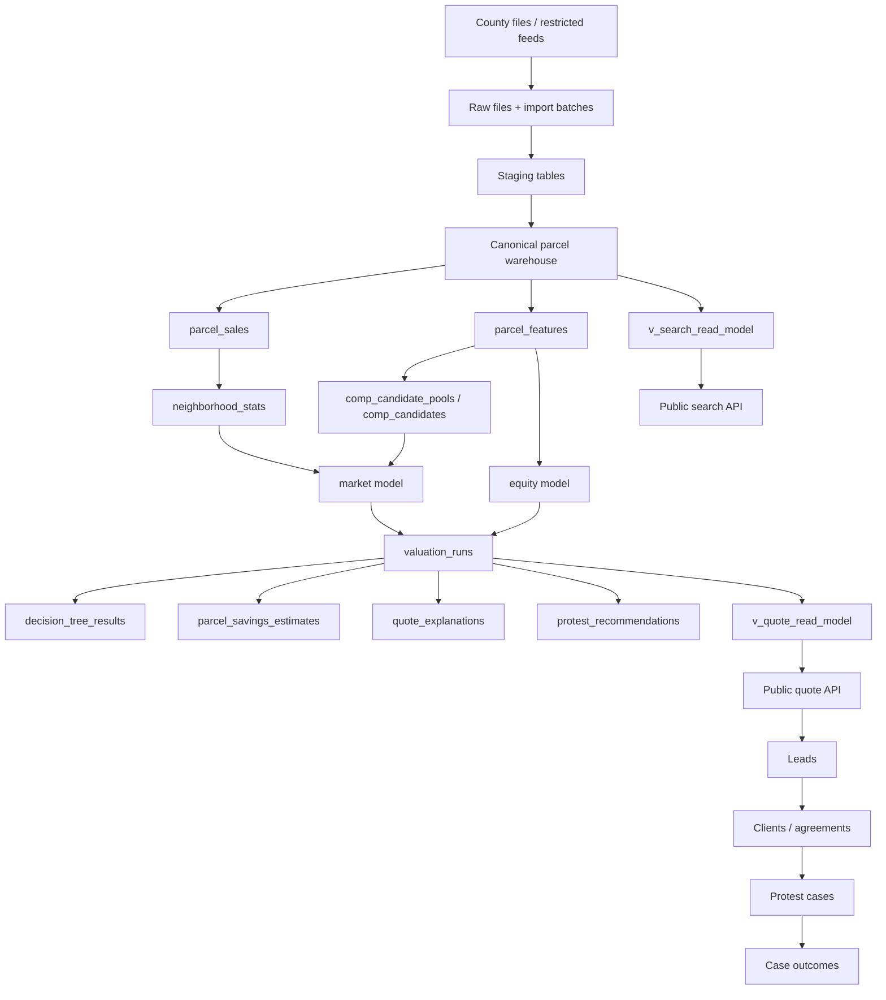

# Dwellio Architecture Map

```mermaid
flowchart TD
    A[County files / restricted feeds] --> B[Raw files + import batches]
    B --> C[Staging tables]
    C --> D[Canonical parcel warehouse]
    D --> E[parcel_sales]
    D --> F[parcel_features]
    E --> G[neighborhood_stats]
    F --> H[comp_candidate_pools / comp_candidates]
    G --> I[market model]
    H --> I
    F --> J[equity model]
    I --> K[valuation_runs]
    J --> K
    K --> L[decision_tree_results]
    K --> M[parcel_savings_estimates]
    K --> N[quote_explanations]
    K --> O[protest_recommendations]
    K --> P[v_quote_read_model]
    D --> Q[v_search_read_model]
    P --> R[Public quote API]
    Q --> S[Public search API]
    R --> T[Leads]
    T --> U[Clients / agreements]
    U --> V[Protest cases]
    V --> W[Case outcomes]
```
